# open-table-migrator

*[Русская версия](README.md)*

Skill + subagent for Claude Code.

Analyzes data projects in **Python, Java, and Scala** (extensible): finds all data read/write operations, builds an I/O map, and migrates to open table formats.

| | |
|---|---|
| **Detector** | Parses code into an AST (Abstract Syntax Tree) via tree-sitter; algorithmic tree walking finds all I/O |
| **Migration** | Parquet / ORC → Iceberg (tested), architecture — any → any |
| **Target formats** | Iceberg now; Paimon / Delta / Hudi planned |



---

## Quick Start

### Option 1: Subagent in Claude Code

Just ask the agent:

> *grab the skill from https://github.com/never-summer/open-table-migrator and let's check the LearningSparkV2 project — run an I/O analysis*

The agent picks up the skill, runs the detector, and returns a report. Example output on [LearningSparkV2](https://github.com/databricks/LearningSparkV2):

> **Found 11 I/O operations across 7 files.**
>
> By direction: **reads = 7**, **writes = 4**
>
> | Pattern type | Count | Direction |
> |---|---|---|
> | `spark_read_csv` | 3 | read |
> | `spark_read_table` | 2 | read |
> | `hive_save_table` | 2 | write |
> | `spark_read_parquet` | 1 | read |
> | `spark_read_json` | 1 | read |
> | `pandas_write_csv` | 1 | write |
> | `stdlib_write_csv` | 1 | write |
>
> **Iceberg migration candidates (format-dependent):**
>
> - `chapter7/scala/.../SortMergeJoinBucketed_7_6.scala:54` — `write.format("parquet")...saveAsTable("UsersTbl")` + `.bucketBy(8,"uid")`
> - `chapter7/scala/.../SortMergeJoinBucketed_7_6.scala:62` — `write.format("parquet")...saveAsTable("OrdersTbl")` + `.bucketBy(8,"users_id")`
> - `mlflow-project-example/train.py:24` — `spark.read.parquet(file_path)` (airbnb dataset)

The agent then asks about each table — migrate or skip, which namespace/table — and emits `lakehouse-worklist.json` for the LLM to rewrite the code. Afterwards it reruns the detector: zero residual patterns.

The [subagent](.claude/agents/open-table-migrator.md) does all of this automatically from a single prompt: *"migrate this project to iceberg"*.

### Option 2: CLI (no LLM)

Project analysis:

```bash
PYTHONPATH=. python -c "
from pathlib import Path
from skills.open_table_migrator.detector import detect_all_io
from skills.open_table_migrator.analyzer import build_report, format_report

matches = detect_all_io(Path('path/to/project'))
print(format_report(build_report(matches), project_root=Path('path/to/project')))
"
```

Single-table migration — emits `lakehouse-worklist.json`:

```bash
PYTHONPATH=. python -m skills.open_table_migrator.cli path/to/project \
    --table events --namespace analytics
```

Multi-table migration:

```bash
PYTHONPATH=. python -m skills.open_table_migrator.cli path/to/project \
    --mapping ./lakehouse-mapping.json
```

Mapping format — see [SKILL.md](skills/open_table_migrator/SKILL.md#multi-table-projects).

---

## Features

### I/O Inventory

Scans `.py`, `.java`, `.scala` files via tree-sitter AST and discovers **all** read/write operations. For each operation it extracts:

- **Direction** — read / write / schema
- **Subject** — DataFrame or variable name
- **Target** (path_arg) — file path or table name
- **Summary** — e.g. `usersDF — writes Parquet to s3://bucket/users [partitionBy("region")]`

Pattern type taxonomy: `{runtime}_{direction}_{format}` (e.g. `spark_read_parquet`, `pandas_write_csv`).

### Migration → Lakehouse

The AST detector finds operations, the CLI produces `lakehouse-worklist.json`, and an agent/LLM rewrites the code.

Converts:

- pandas → pyiceberg (`catalog.load_table(...).scan().to_pandas()`)
- PySpark → `spark.table()` / `df.writeTo().overwritePartitions()`
- Java/Scala Spark → `format("iceberg")` / `writeTo()`
- Hive DDL → `USING iceberg`
- Dependencies: `requirements.txt`, `pyproject.toml`, `pom.xml`, `build.gradle[.kts]`, `build.sbt`

### SQL Registry

Scans `.sql`/`.hql`/`.ddl` files, finds `CREATE TABLE ... STORED AS FORMAT`, and cross-references with code — when code writes to a table via `saveAsTable("events")` but the format is defined in a separate SQL file.

---

## Tests

```bash
PYTHONPATH=. pytest tests/ --ignore=tests/fixtures -v
```

236 tests. Fixtures in `tests/fixtures/` are input data, not test modules.

## Structure

```
skills/open_table_migrator/
├── SKILL.md              # Reference documentation
├── detector.py           # Public API (detect_parquet_usage / detect_all_io)
├── ts_detector.py        # Tree-sitter AST detector (Python/Java/Scala)
├── ts_parser.py          # Tree-sitter wrapper: parsing, Language/Parser cache
├── analyzer.py           # Reports, deduplication, SQL cross-references
├── sql_registry.py       # Table registry from .sql/.hql/.ddl
├── extract.py            # path_arg, subject, summary extraction
├── folding.py            # Multi-line chain folding (JVM transformer only)
├── filters.py            # Filter by direction/pattern/glob
├── targets.py            # Multi-table: mapping, resolver
├── deps.py               # Dependency updater (5 formats)
├── prepass.py            # Skip markers + pyspark conf
├── worklist.py           # lakehouse-worklist.json builder
├── cli.py                # CLI entry point
└── transformers/
    ├── pandas.py
    ├── pyspark.py
    ├── pyarrow.py
    └── jvm.py            # Java + Scala

.claude/agents/
└── open-table-migrator.md  # Subagent
```

## Detector: tree-sitter AST

The detector uses [tree-sitter](https://tree-sitter.github.io/) to parse Python, Java, and Scala. Instead of regex — AST tree walking:

- **No false positives** — AST distinguishes code from strings and comments
- **No manual folding** — the tree knows expression boundaries
- **Dynamic formats** — any `.read.FORMAT()` is captured automatically
- **Unified taxonomy** — `{runtime}_{direction}_{format}` (e.g. `spark_read_parquet`, `pandas_write_csv`)

### Supported Patterns

| Format | Example patterns |
|---|---|
| Parquet | `pd.read_parquet`, `spark.read.parquet`, `pq.write_table`, `.format("parquet")` |
| ORC | `pd.read_orc`, `orc.read_table`, `.format("orc")` |
| CSV | `pd.read_csv`, `spark.read.csv`, `.format("csv")`, `csv.reader` |
| JSON | `pd.read_json`, `.format("json")` |
| Avro | `.format("avro")` |
| Delta | `.format("delta")` |
| JDBC | `spark.read.jdbc`, `.format("jdbc")` |
| Text | `spark.read.text`, `.format("text")` |
| Hive DDL | `CREATE TABLE ... STORED AS FORMAT`, `USING format` |
| Hive DML | `INSERT INTO TABLE`, `INSERT OVERWRITE TABLE`, `saveAsTable` |
| SQL files | `.sql`, `.hql`, `.ddl` — table registry + code cross-references |
| *Any* | Dynamic extraction — `.read.protobuf()`, `.format("tfrecord")`, etc. |

The regex detector is preserved in the `regex-detector` branch.

## Limitations

- Path arguments must be string literals (variables → `TODO(iceberg)`)
- Streaming — warn-only (TODO comment)
- Data is not migrated — code only; for Hive use `CALL catalog.system.migrate(...)`
- JVM coordinates: Spark 3.5 + Scala 2.12
- `partitionBy(...)` in JVM → TODO for manual Iceberg partition spec

Full list — in [SKILL.md § Known Limitations](skills/open_table_migrator/SKILL.md#known-limitations).

## License

Apache License 2.0 — see [LICENSE](LICENSE).
