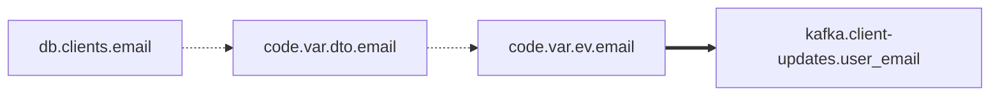

# open-table-migrator

Skill + субагент для Claude Code.

Анализирует data-проекты на **Python, Java и Scala** (расширяемо): находит все точки чтения/записи данных, строит карту I/O-операций и мигрирует на open table format.

| | |
|---|---|
| **Детектор** | Парсит код в AST (Abstract Syntax Tree) через tree-sitter; алгоритмический обход дерева находит все I/O |
| **Миграция** | Parquet / ORC → Iceberg (протестировано), архитектура — any → any |
| **Целевые форматы** | Iceberg сейчас, Paimon / Delta / Hudi / итд планируются |


---

## Быстрый старт

### Вариант 1: Субагент в Claude Code

Просто скажите агенту:

> *возьми скилл из https://github.com/never-summer/open-table-migrator и давай проверим на проекте LearningSparkV2 — проведем анализ I/O*

Агент подхватит скилл, запустит детектор и выдаст отчёт. Пример на [LearningSparkV2](https://github.com/databricks/LearningSparkV2):

> **Обнаружено 11 I/O-операций в 7 файлах.**
>
> По направлению: **reads = 7**, **writes = 4**
>
> | Тип | Кол-во | Направление |
> |---|---|---|
> | `spark_read_csv` | 3 | read |
> | `spark_read_table` | 2 | read |
> | `hive_save_table` | 2 | write |
> | `spark_read_parquet` | 1 | read |
> | `spark_read_json` | 1 | read |
> | `pandas_write_csv` | 1 | write |
> | `stdlib_write_csv` | 1 | write |
>
> **Кандидаты на миграцию в Iceberg (формат-зависимые):**
>
> - `chapter7/scala/.../SortMergeJoinBucketed_7_6.scala:54` — `write.format("parquet")...saveAsTable("UsersTbl")` + `.bucketBy(8,"uid")`
> - `chapter7/scala/.../SortMergeJoinBucketed_7_6.scala:62` — `write.format("parquet")...saveAsTable("OrdersTbl")` + `.bucketBy(8,"users_id")`
> - `mlflow-project-example/train.py:24` — `spark.read.parquet(file_path)` (airbnb dataset)

Дальше агент спрашивает по каждой таблице — мигрировать или оставить, в какой namespace/table — и выдаёт `lakehouse-worklist.json` для LLM, который переписывает код. После — повторный прогон детектора: ноль остаточных паттернов.

[Субагент](.claude/agents/open-table-migrator.md) делает всё это автоматически по одной фразе: *"мигрируй на iceberg"* / *"migrate this project to iceberg"*.

### Вариант 2: CLI (без LLM)

Анализ проекта:

```bash
PYTHONPATH=. python -c "
from pathlib import Path
from skills.open_table_migrator.detector import detect_all_io
from skills.open_table_migrator.analyzer import build_report, format_report

matches = detect_all_io(Path('путь/к/проекту'))
print(format_report(build_report(matches), project_root=Path('путь/к/проекту')))
"
```

Миграция одной таблицы — выдаёт `lakehouse-worklist.json`:

```bash
PYTHONPATH=. python -m skills.open_table_migrator.cli путь/к/проекту \
    --table events --namespace analytics
```

Миграция нескольких таблиц:

```bash
PYTHONPATH=. python -m skills.open_table_migrator.cli путь/к/проекту \
    --mapping ./iceberg-mapping.json
```

Формат маппинга — в [SKILL.md](skills/open_table_migrator/SKILL.md#multi-table-projects).

---

## Возможности

### Инвентаризация I/O

Сканирует `.py`, `.java`, `.scala` файлы через tree-sitter AST и находит **все** операции чтения и записи. Для каждой определяется:

- **Направление** — read / write / schema
- **Объект** (subject) — имя DataFrame или переменной
- **Цель** (path_arg) — путь или имя таблицы
- **Краткое описание** — например: `usersDF — writes Parquet to s3://bucket/users [partitionBy("region")]`

Таксономия pattern_type: `{runtime}_{direction}_{format}` (напр. `spark_read_parquet`, `pandas_write_csv`).

### Миграция → Lakehouse

AST-детектор находит операции, CLI выдает `lakehouse-worklist.json`, агент/LLM переписывает код.

Конвертирует:

- pandas → pyiceberg (`catalog.load_table(...).scan().to_pandas()`)
- PySpark → `spark.table()` / `df.writeTo().overwritePartitions()`
- Java/Scala Spark → `format("iceberg")` / `writeTo()`
- Hive DDL → `USING iceberg`
- Зависимости: `requirements.txt`, `pyproject.toml`, `pom.xml`, `build.gradle[.kts]`, `build.sbt`

### SQL-реестр

Сканирует `.sql`/`.hql`/`.ddl` файлы, находит `CREATE TABLE ... STORED AS FORMAT` и строит кросс-ссылки с кодом — когда код пишет в таблицу через `saveAsTable("events")`, а формат определен в отдельном SQL-файле.

---

## Тесты

```bash
PYTHONPATH=. pytest tests/ --ignore=tests/fixtures -v
```

179 тестов. Фикстуры в `tests/fixtures/` — входные данные, не тестовые модули.

## Структура

```
skills/open_table_migrator/
├── SKILL.md              # Справочная документация
├── detector.py           # Публичный API (detect_parquet_usage / detect_all_io)
├── ts_detector.py        # Tree-sitter AST-детектор (Python/Java/Scala)
├── ts_parser.py          # Обёртка tree-sitter: парсинг, кеш Language/Parser
├── analyzer.py           # Отчеты, дедупликация, SQL кросс-ссылки
├── sql_registry.py       # Реестр таблиц из .sql/.hql/.ddl
├── extract.py            # Извлечение path_arg, subject, описания
├── filters.py            # Фильтрация по направлению/паттерну/glob
├── targets.py            # Мульти-таблица: маппинг, резолвер
├── deps.py               # Обновление зависимостей (5 форматов)
├── prepass.py            # Skip-маркеры + pyspark conf
├── worklist.py           # lakehouse-worklist.json builder
└── cli.py                # CLI entry point

.claude/agents/
└── open-table-migrator.md  # Субагент
```

## Детектор: tree-sitter AST

Детектор использует [tree-sitter](https://tree-sitter.github.io/) для парсинга Python, Java и Scala. Вместо regex — обход AST-дерева:

- **Нет ложных срабатываний** — AST отличает код от строк и комментариев
- **Нет ручного folding** — дерево знает границы выражений
- **Динамические форматы** — любой `.read.FORMAT()` попадает автоматически
- **Единая таксономия** — `{runtime}_{direction}_{format}` (напр. `spark_read_parquet`, `pandas_write_csv`)

Regex-детектор сохранён в ветке `regex-detector`.

### Поддерживаемые паттерны

| Формат | Примеры паттернов |
|---|---|
| Parquet | `pd.read_parquet`, `spark.read.parquet`, `pq.write_table`, `.format("parquet")` |
| ORC | `pd.read_orc`, `orc.read_table`, `.format("orc")` |
| CSV | `pd.read_csv`, `spark.read.csv`, `.format("csv")`, `csv.reader` |
| JSON | `pd.read_json`, `.format("json")` |
| Avro | `.format("avro")` |
| Delta | `.format("delta")` |
| JDBC | `spark.read.jdbc`, `.format("jdbc")` |
| Text | `spark.read.text`, `.format("text")` |
| Hive DDL | `CREATE TABLE ... STORED AS FORMAT`, `USING format` |
| Hive DML | `INSERT INTO TABLE`, `INSERT OVERWRITE TABLE`, `saveAsTable` |
| SQL-файлы | `.sql`, `.hql`, `.ddl` — реестр таблиц + кросс-ссылки с кодом |
| *Любой* | Динамическое извлечение — `.read.protobuf()`, `.format("tfrecord")`, и т.д. |

## Ограничения

- Path-аргументы должны быть строковыми литералами (переменные → `TODO(iceberg)`)
- Streaming — только warn-only (TODO-комментарий)
- Данные не мигрируются — только код; для Hive используйте `CALL catalog.system.migrate(...)`
- JVM-координаты: Spark 3.5 + Scala 2.12
- `partitionBy(...)` в JVM → TODO для ручного добавления в Iceberg partition spec

Полный список — в [SKILL.md § Known Limitations](skills/open_table_migrator/SKILL.md#known-limitations).

---

# Sibling skill: data_lineage

Column-level lineage для Spring Boot / jOOQ / JdbcTemplate / Spring Kafka / Spring Web проектов. Принцип тот же (tree-sitter + чистый Python), цель другая — построить граф потоков данных, не трогая код.

Подробный reference — в [`skills/data_lineage/SKILL.md`](skills/data_lineage/SKILL.md). Дизайн — в [`docs/superpowers/specs/2026-05-07-data-lineage-design.md`](docs/superpowers/specs/2026-05-07-data-lineage-design.md).

## Что покрывает

| Источник / приёмник | Что детектится |
|---|---|
| jOOQ DSL | типизированные `TABLE.COLUMN` цепочки: `select` / `selectFrom` / `insertInto` / `update` / `deleteFrom` |
| JdbcTemplate | SQL-литералы в `query` / `queryForObject` / `update` / `batchUpdate` / `execute` |
| Spring Data | `@Query` (JPQL и `nativeQuery=true`) + derived методы (`findByEmail` → колонка `email`) |
| Spring Kafka | `KafkaTemplate.send(...)` + `@KafkaListener(topics=...)` + payload DTO |
| Spring Web | `@RestController` + `@GetMapping`/`@PostMapping`/etc. + `@RequestBody` + `RestClient` |
| DTO | POJO-поля, Lombok `@Data`/`@Getter`, Jackson `@JsonProperty(name=...)`, `@JsonIgnore` |

Не покрывается (Phase 5): Oracle stored procedures, Spring Cache (Ehcache), Avro/Protobuf-схемы.

## Установка

```bash
# Если ещё не установлен open-table-migrator (deps общие):
pip install -e ".[test]"
```

Дополнительная зависимость только одна — `sqlglot`. JVM не нужна.

## Пример: synthetic-spring-app

В репо лежит синтетический Spring Boot проект на 9 файлов в [`tests/data_lineage/fixtures/synthetic-spring-app/`](tests/data_lineage/fixtures/synthetic-spring-app/) — модули `api`, `app`, `db`, jOOQ-репозиторий, JdbcTemplate-репозиторий, Kafka producer + listener, REST controller, два DTO с `@JsonProperty(name="user_email")`. Хороший пример "что увидит инструмент".

### Шаг 1: Анализ

```bash
PYTHONPATH=. python3 -m skills.data_lineage \
    tests/data_lineage/fixtures/synthetic-spring-app \
    --output /tmp/dl-demo
```

Создаются три файла:
```
/tmp/dl-demo/
├── lineage-report.txt    # текстовый отчёт (то же что в stdout)
├── lineage-graph.json    # полный граф (узлы + рёбра + unresolved)
└── lineage.mmd           # Mermaid-диаграмма
```

Текстовый отчёт начинается с summary:
```
Lineage report — 41 nodes, 24 edges, 0 unresolved
```

### Шаг 2: Читаем confidence-секции

Граф разбит на три уровня доверия. **HIGH** — извлечено напрямую из SQL/jOOQ DSL через AST:

```
=== HIGH confidence (8) ===
  db.clients.id     --read-->   code.var.id      [db/.../ClientRepository.java:7]
  db.clients.email  --read-->   code.var.email   [db/.../ClientRepository.java:7]
  code.var.email    --write-->  db.clients.email [db/.../ClientRepository.java:10]
  db.devices.mac    --read-->   code.var.mac     [db/.../DeviceRepository.java:5]
  ...
```

Это типы рёбер где инструмент уверен на 100%: jOOQ `dsl.select(CLIENTS.ID, CLIENTS.EMAIL)` и JdbcTemplate `"SELECT id, mac, owner_id FROM devices"`.

**MEDIUM** — построено через эвристики имён (Lombok-getter ↔ field, Jackson-rename, Spring Data method-name). Здесь живёт самое интересное — соединение SQL с Kafka-payload через DTO:

```
=== MEDIUM confidence (15) ===
  code.var.dto.email      --transform-->  code.var.ev.email                [ClientService.java:7]
  code.var.ev.email       --write-->      kafka.client-updates.user_email  [ClientService.java:8]
  kafka.client-updates.user_email  --read-->  code.dto.com.example.dto.ClientUpdateEvent.email
  http.GET:/clients/{id}.response.user_email  --read-->  code.dto.com.example.dto.ClientDto.email
```

Обрати внимание на `user_email` — это Jackson `@JsonProperty("user_email")` на поле `email`. Если бы аннотации не было, в графе было бы `kafka.client-updates.email`. Эта детализация ради того, чтобы граф соответствовал тому что реально летит на проводе, а не Java-имени поля.

**LOW** — Java DFA не смогла резолвить целевой DTO. В нашем фикстуре сюда попадает RestClient-вызов, payload-тип которого мы не вычислили:

```
=== LOW confidence (1) ===
  code.var.dto  --write-->  http.POST:/notify  [ClientService.java:11]
```

Граф соединил `dto` с эндпоинтом, но не пробросил поля DTO в `http.POST:/notify.request.*`. Это explicit граница автоматики — пользователь видит что вот тут не дотащили.

### Шаг 3: Mermaid-визуализация

`lineage.mmd` — самодостаточный flowchart, открывается в любом Markdown-просмотрщике (GitHub, Obsidian, Mermaid Live):



На реальном проекте полный mmd быстро становится нечитаемым (сотни узлов). Используй фильтры — см. шаг 4.

### Шаг 4: Фильтры

Свести граф до окрестности конкретной таблицы:

```bash
PYTHONPATH=. python3 -m skills.data_lineage <project> \
    --output /tmp/dl-clients --only-table clients
```

Аналогично — `--only-topic client-updates`, `--max-depth 2` (BFS-радиус от seed-узлов).

### Шаг 5: `--debug` для отладки

Если на реальном проекте граф выглядит странно, прогон с `--debug` пишет промежуточные стейджи пайплайна:

```bash
PYTHONPATH=. python3 -m skills.data_lineage <project> --output /tmp/dl --debug --quiet
ls /tmp/dl/debug/
# 01-symbol-table.json    # все DTO классы что нашёл project_scan
# 02-sql-units.json       # SQL-литералы и jOOQ-цепочки от sql_extract
# 03-sql-edges.json       # column-edges от sqlglot
# 04-java-edges.json      # DFA-edges
```

Можно посмотреть какой именно SQL не распарсился, какой DTO не нашёлся, и т.д.

## Через субагента

Если работаешь в Claude Code — есть готовый субагент. Триггерные фразы:

> *"проанализируй data lineage в проекте"*
> *"построй граф потоков данных"*
> *"build data lineage for this project"*

Субагент запустит CLI, парснет отчёт, покажет summary, даст разобрать low-confidence рёбра и unresolved-секции, по запросу отрендерит подграф.

## Ограничения

Жёстко не разбираемые случаи попадают в секцию `unresolved`:
- SQL собранный через `StringBuilder` / `String.format` / `String.join`
- MapStruct-мапперы и кастомные Jackson-сериализаторы
- Reflection-сериализация
- Stored procedures (Phase 5)

Cross-table контаминация фильтров: `--only-table X` ходит BFS через `code.var.*` узлы; если две таблицы делят имя переменной (например, `id` есть в обеих), подграф может включить обе. Это by design — переменные глобальны в области анализа. Используй `--max-depth 1` для жёсткого scope.

Полный список ограничений и confidence-семантика — в [SKILL.md](skills/data_lineage/SKILL.md).
