# open-table-migrator

Skill + субагент для Claude Code.

Анализирует data-проекты на **Python, Java и Scala** (расширяемо): находит все точки чтения/записи данных, строит карту I/O-операций и мигрирует на open table format.

| | |
|---|---|
| **Детектор** | Tree-sitter AST — находит любой формат автоматически |
| **Миграция** | Parquet / ORC → Iceberg (протестировано), архитектура — any → any |
| **Целевые форматы** | Iceberg сейчас, Paimon / Delta / Hudi / итд планируются |



---

## Возможности

### Инвентаризация I/O

Сканирует `.py`, `.java`, `.scala` файлы через tree-sitter AST и находит **все** операции чтения и записи. Для каждой определяется:

- **Направление** — read / write / schema
- **Объект** (subject) — имя DataFrame или переменной
- **Цель** (path_arg) — путь или имя таблицы
- **Краткое описание** — например: `usersDF — writes Parquet to s3://bucket/users [partitionBy("region")]`

Таксономия pattern_type: `{runtime}_{direction}_{format}` (напр. `spark_read_parquet`, `pandas_write_csv`).

### Миграция → Lakehouse

AST-детектор находит операции, CLI выдает `lakehouse-worklist.json`, агент/LLM переписывает код.

Конвертирует:

- pandas → pyiceberg (`catalog.load_table(...).scan().to_pandas()`)
- PySpark → `spark.table()` / `df.writeTo().overwritePartitions()`
- Java/Scala Spark → `format("iceberg")` / `writeTo()`
- Hive DDL → `USING iceberg`
- Зависимости: `requirements.txt`, `pyproject.toml`, `pom.xml`, `build.gradle[.kts]`, `build.sbt`

### SQL-реестр

Сканирует `.sql`/`.hql`/`.ddl` файлы, находит `CREATE TABLE ... STORED AS FORMAT` и строит кросс-ссылки с кодом — когда код пишет в таблицу через `saveAsTable("events")`, а формат определен в отдельном SQL-файле.

---

## Быстрый старт

### Вариант 1: Субагент в Claude Code

Скажите:

> *"проанализируй все чтения и записи в проекте"*
> *"мигрируй на iceberg"*
> *"migrate this project to iceberg"*

[Субагент](.claude/agents/open-table-migrator.md) автоматически:
1. Запустит детектор и покажет таблицу всех I/O-операций
2. Просканирует SQL-файлы и покажет кросс-ссылки
3. Спросит какие таблицы мигрировать, а какие оставить
4. Выполнит миграцию по worklist
5. Проверит результат — детектор должен вернуть ноль остаточных паттернов

### Вариант 2: CLI

Анализ (без LLM):

```bash
PYTHONPATH=. python -c "
from pathlib import Path
from skills.open_table_migrator.detector import detect_all_io
from skills.open_table_migrator.analyzer import build_report, format_report

matches = detect_all_io(Path('путь/к/проекту'))
print(format_report(build_report(matches), project_root=Path('путь/к/проекту')))
"
```

Миграция (одна таблица — выдает `lakehouse-worklist.json`):

```bash
PYTHONPATH=. python -m skills.open_table_migrator.cli путь/к/проекту \
    --table events --namespace analytics
```

Миграция (несколько таблиц):

```bash
PYTHONPATH=. python -m skills.open_table_migrator.cli путь/к/проекту \
    --mapping ./iceberg-mapping.json
```

Формат маппинга — в [SKILL.md](skills/open_table_migrator/SKILL.md#multi-table-projects).

---

## Пример: LearningSparkV2

Проект [LearningSparkV2](https://github.com/databricks/LearningSparkV2) — примеры из книги *Learning Spark*, ~30 Scala/Java/Python файлов с разнообразным Spark I/O.

### Шаг 1: Анализ

```
> проанализируй все чтения и записи в LearningSparkV2
```

Детектор находит ~25 операций в 12 файлах:

```
Found 25 data I/O operation(s) across 12 file(s):

By direction:
  read   : 11
  write  : 12
  schema :  2

Per-file breakdown:
  chapter04/scala/src/main/scala/SparkJob.scala:
    spark_write_parquet  (write)  line 54:59
      usersDF — writes Parquet to UsersTbl [bucketBy(8, "uid"), partitionBy("region")]
    spark_read_parquet   (read)   line 62:62
      logsDF — reads Parquet from s3://bucket/logs
  ...
```

Плюс кросс-ссылки с SQL:

```
SQL-defined tables with 2 code cross-reference(s):
  SparkJob.scala:57  write 'UsersTbl'  — defined as parquet in schema.sql:3
  SparkJob.scala:72  write 'EventsTbl' — defined as parquet in schema.sql:8
```

### Шаг 2: Решение по каждой таблице

Агент спрашивает по каждому sink/source:

> *Операция `write` на `UsersTbl` (2 call sites) — мигрировать на Iceberg? Namespace/table?*

Пользователь отвечает:
- `UsersTbl` → `analytics.users`
- `EventsTbl` → `analytics.events`
- `s3://bucket/logs` → оставить как есть (`skip: true`)

### Шаг 3: Миграция

```bash
PYTHONPATH=. python -m skills.open_table_migrator.cli ./LearningSparkV2 \
    --mapping iceberg-mapping.json
```

CLI выдает `lakehouse-worklist.json` с задачами для агента. Агент переписывает каждую операцию через `Edit`, затем перезапускает детектор — ноль остаточных паттернов.

---

## Тесты

```bash
PYTHONPATH=. pytest tests/ --ignore=tests/fixtures -v
```

236 тестов. Фикстуры в `tests/fixtures/` — входные данные, не тестовые модули.

## Структура

```
skills/open_table_migrator/
├── SKILL.md              # Справочная документация
├── detector.py           # Публичный API (detect_parquet_usage / detect_all_io)
├── ts_detector.py        # Tree-sitter AST-детектор (Python/Java/Scala)
├── ts_parser.py          # Обёртка tree-sitter: парсинг, кеш Language/Parser
├── analyzer.py           # Отчеты, дедупликация, SQL кросс-ссылки
├── sql_registry.py       # Реестр таблиц из .sql/.hql/.ddl
├── extract.py            # Извлечение path_arg, subject, описания
├── folding.py            # Склейка многострочных цепочек (только для JVM-трансформера)
├── filters.py            # Фильтрация по направлению/паттерну/glob
├── targets.py            # Мульти-таблица: маппинг, резолвер
├── deps.py               # Обновление зависимостей (5 форматов)
├── prepass.py            # Skip-маркеры + pyspark conf
├── worklist.py           # lakehouse-worklist.json (hybrid)
├── cli.py                # CLI entry point
└── transformers/
    ├── pandas.py
    ├── pyspark.py
    ├── pyarrow.py
    └── jvm.py            # Java + Scala

.claude/agents/
└── open-table-migrator.md  # Субагент
```

## Детектор: tree-sitter AST

Детектор использует [tree-sitter](https://tree-sitter.github.io/) для парсинга Python, Java и Scala. Вместо regex — обход AST-дерева:

- **Нет ложных срабатываний** — AST отличает код от строк и комментариев
- **Нет ручного folding** — дерево знает границы выражений
- **Динамические форматы** — любой `.read.FORMAT()` попадает автоматически
- **Единая таксономия** — `{runtime}_{direction}_{format}` (напр. `spark_read_parquet`, `pandas_write_csv`)

Regex-детектор сохранён в ветке `regex-detector`.

### Поддерживаемые паттерны

| Формат | Примеры паттернов |
|---|---|
| Parquet | `pd.read_parquet`, `spark.read.parquet`, `pq.write_table`, `.format("parquet")` |
| ORC | `pd.read_orc`, `orc.read_table`, `.format("orc")` |
| CSV | `pd.read_csv`, `spark.read.csv`, `.format("csv")`, `csv.reader` |
| JSON | `pd.read_json`, `.format("json")` |
| Avro | `.format("avro")` |
| Delta | `.format("delta")` |
| JDBC | `spark.read.jdbc`, `.format("jdbc")` |
| Text | `spark.read.text`, `.format("text")` |
| Hive DDL | `CREATE TABLE ... STORED AS FORMAT`, `USING format` |
| Hive DML | `INSERT INTO TABLE`, `INSERT OVERWRITE TABLE`, `saveAsTable` |
| SQL-файлы | `.sql`, `.hql`, `.ddl` — реестр таблиц + кросс-ссылки с кодом |
| *Любой* | Динамическое извлечение — `.read.protobuf()`, `.format("tfrecord")`, и т.д. |

## Ограничения

- Path-аргументы должны быть строковыми литералами (переменные → `TODO(iceberg)`)
- Streaming — только warn-only (TODO-комментарий)
- Данные не мигрируются — только код; для Hive используйте `CALL catalog.system.migrate(...)`
- JVM-координаты: Spark 3.5 + Scala 2.12
- `partitionBy(...)` в JVM → TODO для ручного добавления в Iceberg partition spec

Полный список — в [SKILL.md § Known Limitations](skills/open_table_migrator/SKILL.md#known-limitations).
